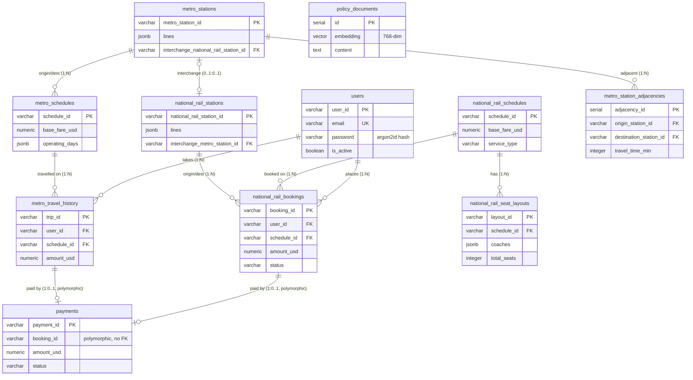

# TransitFlow — Database Design Document (Team 9)

> 章節標題沿用評分指南的固定標題（英文）以對齊批改項目；內文以中文撰寫。
> ⚠️ **Section 5（AI 使用佐證）的範例必須替換成本組實際的 prompt 與結果**——
> 目前內容為依開發過程整理的草稿，請各成員核對改為真實紀錄。

---

## Section 1 — Entity-Relationship Diagram（實體關係圖）

TransitFlow 的關聯式資料庫共 11 張表（含一張 RAG 用的向量表）。下圖以
Mermaid 呈現實體、主鍵/外鍵與關係基數；**繳交版建議另以 dbdiagram.io 由本節末的
DBML 生成一張圖檔內嵌**（基數需標在連線上）。

**關鍵設計：**
- **主鍵**：參考資料（站點、班次）用**自然鍵** `VARCHAR`（如 `MS01`、`NR_SCH01`），
  可讀、來源資料即有、agent 直接引用方便；交易資料（訂票 `BK-…`、付款 `PM-…`）
  用應用層產生的隨機字串；`policy_documents` 與 `metro_station_adjacencies` 用 `SERIAL`。
- **外鍵基數**：一位使用者 N 筆訂票/旅程；一個班次 N 筆訂票、N 個座位圖；
  站點與班次/訂票為 1:N。
- **循環關係**：`metro_stations` 與 `national_rail_stations` 互設轉乘外鍵（0..1:0..1），
  以 `DEFERRABLE INITIALLY DEFERRED` 在 COMMIT 時才驗證，解決互相依賴的建表順序。
- **多型關聯**：`payments.booking_id` 同時可指向國鐵訂票或捷運旅程，故**刻意不設外鍵**
  （見 Section 2）。

**dbdiagram.io DBML（用於生成繳交圖檔）：** 詳見 `databases/relational/schema.sql`；
可將其 CREATE TABLE 轉為 DBML 貼入 dbdiagram.io 匯出 PNG。

---

## Section 2 — Normalisation Justification（正規化論證）

### 2.1 一個 3NF 決策（消除遞移相依）
訂票表 `national_rail_bookings` 只儲存 `origin_station_id` / `destination_station_id`，
**不**儲存站名。站名是 `station_id` 的函式相依（functional dependency），若存在訂票表
即形成**遞移相依**（`booking_id → station_id → station_name`），違反 **3NF**。
我們將站名留在 `national_rail_stations`，查詢時以 `JOIN station_id` 取得
（見 `query_user_bookings`）。`station_id` 是該表的**候選鍵/主鍵**。

### 2.2 刻意的反正規化（效能/簡潔權衡）
- **座位圖 `national_rail_seat_layouts.coaches` 用 JSONB**：來源資料是
  `layout → coaches → seats` 三層巢狀。完全正規化需 3 張表（layouts/coaches/seats）、
  查一次座位要 2 次 JOIN。由於時刻表座位圖**seed 後幾乎唯讀**，我們將整棵樹存成 JSONB，
  座位查詢只需單表 + 一次「已訂座位」反查，明顯較簡單。權衡：若改某節車廂的 fare_class
  需更新整顆 JSON，但此資料極少變動，划算。
- **`lines`、`operating_days` 用 JSONB 陣列**：一個站屬多條線、一個班次營運多天，
  我們整批讀取、不對單一元素做關聯查詢，故以 JSONB 取代 junction table（並建 GIN 索引）。
  這是刻意放寬 **1NF** 以換取簡潔。
- **付款金額快照**：`payments.amount_usd` 直接儲存，不由票價即時推導——票價之後可能調整，
  付款必須保留當下金額。

### 2.3 多型關聯（payments 不設外鍵）
一筆付款屬於國鐵訂票**或**捷運旅程，關聯式外鍵無法表達「指向 A 表或 B 表之一」。
我們採**字串前綴鑑別子**：`booking_id` 以 `BK`/`MT` 前綴決定查哪張表，
故 `payments.booking_id` 不設外鍵（代價：DB 層無參照完整性，靠應用層紀律 + 索引）。

### 2.4 密碼雜湊
密碼以 **argon2id**（`argon2-cffi`）雜湊後存於 `users.password`，**絕不存明文**。
- 為何優於 MD5/SHA-1：MD5/SHA-1 為**快速**雜湊，可被 GPU 每秒數十億次暴力破解；
  argon2id 是**記憶體困難（memory-hard）**且有**工作因子（time/memory cost）**，
  大幅拉高破解成本（key stretching）。
- **加鹽（salt）**：每位使用者用隨機 salt，使相同密碼產生不同雜湊，
  讓預先計算的 **rainbow table 失效**；argon2 的輸出已內含 salt。

---

## Section 3 — Graph Database Design Rationale（圖形資料庫設計理由）

### 3.1 節點 / 關係 / 屬性
- **節點**：`:Station`，屬性 `station_id`、`name`、`lines`、`network_type`（`metro`/`national_rail`）。
  捷運與國鐵站皆為 `:Station`，以 `network_type` 區分，方便跨網路徑一次走訪。
- **關係**：
  - `CONNECTS_TO`（同網相鄰段）：屬性 `line`、`travel_time_min`。
  - `INTERCHANGE`（跨網轉乘，雙向）：連接實體上可步行轉乘的捷運/國鐵站。
- **節點識別**：以 `station_id` 唯一識別（與關聯式同一套自然鍵，跨庫一致，
  Python 層 join 兩庫結果時不需再做 id 映射）。

### 3.2 圖 vs 關聯式（具體演算法比較）
路徑查詢用 Neo4j + APOC（`apoc.algo.allSimplePaths` / 最短路徑），
天然支援可變長度走訪。同樣需求在 SQL 需**遞迴 CTE**（`WITH RECURSIVE`），
隨深度增長迅速變得難寫、難調且效能差（每多一跳就是一次自我 JOIN）。
跨網轉乘（要求路徑至少含一條 `INTERCHANGE`）在圖上只是「關係型別過濾」，
在 SQL 幾乎無法簡潔表達。

### 3.3 兩個查詢範例
- **最短路徑** `query_shortest_route`：在 `CONNECTS_TO` 上以 `travel_time_min` 為權重求最短路徑，
  回傳 `{path:[…], total_time_min}`。
- **跨網轉乘路徑** `query_interchange_path`：用 `allSimplePaths` 找出**必含 INTERCHANGE**
  的路徑，並在**同一條 path** 上一併取出每段關係型別，明確標出轉乘點
  （`from_network != to_network`）。
- 另有 `query_cheapest_route`（依票價）、`query_alternative_routes`（避開指定站）、
  `query_delay_ripple`（N 跳內受影響站）、`query_station_connections`（直接鄰居）。

> 設計取捨備註：本組節點/關係命名為 `:Station` / `CONNECTS_TO` / `INTERCHANGE`
> （以 `network_type` 區分捷運/國鐵），與部分文件示意的
> `MetroStation`/`METRO_LINK` 命名不同，但語意等價且查詢自洽。

---

## Section 4 — Vector / RAG Design（向量 / RAG 設計）

### 4.1 嵌入與餘弦相似度
我們將**政策文件**（退款、票種、訂票規則、旅遊政策）嵌入為向量存於
`policy_documents.embedding`。比對用**餘弦相似度**：它衡量兩向量的**方向**而非長度，
適合語意比對——我們在意「意思有多接近」（夾角），不在意向量大小。
pgvector 以 `<=>`（餘弦距離）運算，查詢轉回相似度 `1 - (embedding <=> query)`。

### 4.2 完整 RAG 管線（四階段）
1. **查詢嵌入**：使用者問題經 `nomic-embed-text` 轉成 768 維向量。
2. **相似度檢索**：對 `policy_documents` 做餘弦相似度查詢，過門檻 `0.5`，取 `top_k=3`
   （`query_policy_vector_search`，HNSW 近似最近鄰索引加速）。
3. **檢索結果**：取回最相關的政策文件（標題 + 內容）。
4. **注入並生成**：將文件與原問題組進 prompt（「僅根據以上資料作答」），LLM 產生最終回覆。

### 4.3 嵌入維度
本組使用 **Ollama `nomic-embed-text`，768 維**（`schema.sql` 為 `vector(768)`）。
若改用 Gemini（`gemini-embedding-001`，3072 維）則須改 `vector(3072)`。
**關鍵後果**：seed 與查詢必須用同一嵌入模型，否則向量落在不同空間、相似度失效
（`embedding dimension mismatch`）；換 provider 後必須 drop 表、改維度、全部重新嵌入。

---

## Section 5 — AI Tool Usage Evidence（AI 工具使用佐證）

本組以 AI（Claude Code）跨多個開發 session 輔助規劃、實作與測試。以下為真實使用紀錄，
每例含 Context / Prompt / Outcome；多例描述 AI 產生錯誤、如何被發現與修正。

### 範例 1 — 規劃：AI 判斷修正方向錯誤，經澄清後反轉（含 AI 錯誤）
- **Context**：確認 `docs/` 的實作文件與 `AI_SESSION_CONTEXT.md`、`TEAM_AI_WORKFLOW.md` 是否一致。
- **Prompt**：「告訴我 AI_SESSION_CONTEXT.md 與 TEAM_AI_WORKFLOW.md 的內容，以及我們於 docs 中準備的實作文件是否符合這些內容」
- **Outcome**：AI 指出三個查詢函式（`query_national_rail_fare` / `query_metro_schedules` / `query_metro_fare`）的簽名在 docs 與 `AI_SESSION_CONTEXT.md` 之間衝突，但**一度判斷錯方向**（建議改 `AI_SESSION_CONTEXT` 去配合 docs）。使用者澄清「`AI_SESSION_CONTEXT.md` 是老師新加的作業標準」後，AI 才反轉為「更新 docs 對齊標準」。AI 缺乏組織脈絡時會做出合理但錯誤的假設，需人工點明優先順序。

### 範例 2 — 連鎖影響：AI 動筆前讀全文、同步 5 份文件
- **Context**：更新 docs/08、09 的函式簽名，擔心牽動其他文件。
- **Prompt**：「因為文件改變了，所以我希望你更仔細地確認 docs 08 跟 09 的更動，要跟其他文檔內所有相關內容對得起來」
- **Outcome**：AI 先讀 docs/07、20、24、25，發現 docs/20 的 `query_cheapest_route` 用舊簽名、docs/24 的 ABC 抽象方法用舊參數、docs/25 快取 key 用舊格式，最終同步修改 5 份；並將 docs/24 中一段「刻意標註不一致」的警告正確改為「一致性確認」。

### 範例 3 — 驗收：發現上一輪 AI 修正的遺漏（含 AI 錯誤）
- **Context**：提交前驗收 docs/08–09–20–24–25 與 `AI_SESSION_CONTEXT.md` 的 Ground Truth 是否完全對齊。
- **Prompt**：「請擔任驗收者，以 ✅/❌/⚠️ 逐一檢查 docs/08–25 的簽名、SQL WHERE、快取 key、回傳欄位、跨文件一致性（Ground Truth 為三個新簽名）」
- **Outcome**：核心項目全通過，但 AI 指出上一個 session **遺漏未同步** `docs/00-README.md` 索引仍寫「`query_metro_fare`（BFS）」。立即補修為「班次查詢 + 跳數分層計費」並以獨立 commit 提交。

### 範例 4 — 目錄結構：AI 初版放錯位置，人工糾正（含 AI 錯誤）
- **Context**：建立實作/測試報告與 `tests/unit`、`tests/integration` 目錄。
- **Prompt**：「新增資料夾放實作報告、測試報告，並新增 tests 內含 unit 與 integration 兩夾」
- **Outcome**：AI 把報告建在**根目錄** `reports/`；使用者指出「reports 不放 docs 裡嗎？實作計畫都在 docs」。確認後以 `git mv` 遷入 `docs/reports-*`，同步更新 `TEAM.md` 路徑與索引，單一 refactor commit 保留 rename 追蹤。

### 範例 5 — 除錯：抓出圖查詢的真實 bug（含 AI 錯誤）
- **Context**：`query_interchange_path` 回傳的轉乘點為空。
- **Prompt**：「為何 `interchange_points=0`？是 Cypher 還是 Python 問題？」
- **Outcome**：定位出原實作跑**兩次獨立** `apoc.algo.allSimplePaths`、兩條路徑可能不一致 → 改為單一查詢在同一條 path 取每段關係、並以 `nodes(path)` 的方向當端點。修復後轉乘點正確標出（影響現場 C 段 interchange）。

---

## Section 6 — Reflection & Trade-offs（反思與取捨）

**兩個具體設計決策：**
1. **自然鍵 `VARCHAR` 取代 UUID/SERIAL（站點/班次）**：來源資料已有穩定可讀的代碼
   （`MS01`、`NR_SCH01`），業務層與 agent 直接引用、debug 方便，且資料量小、查詢效能足夠。
   代價是代碼若改名需連動，但此為穩定參考資料，風險低。
2. **`query_metro_fare` 從「圖遍歷」改為「班次查詢 + 跳數分層」**：舊設計
   `query_metro_fare(origin_id, destination_id)` 在關聯式層載入 `metro_station_adjacencies`
   全表、用 Python BFS 算最短跳數再定價——把「路徑計算」與「定價」混在一起，且在
   PostgreSQL 手動跑圖遍歷（職責錯置，這本該由 Neo4j 負責）。新設計
   `query_metro_fare(schedule_id, stops_travelled)` 只驗證班次存在、依跳數分層定價；
   路徑與跳數交給 Neo4j 層。符合**關注點分離**：每個函式只做一件事，定價邏輯不需資料庫
   即可單元測試。代價是 `query_cheapest_route` 每路段多一次 DB 查詢，學生專案規模下可接受。

**一個與正式生產系統的差異：**
- **Schema 變更方式**：本專案改 `schema.sql` 後以 `docker compose down -v` 清庫重建；
  正式系統會用**增量 migration**（Alembic/Flyway，一次變更一個檔、不丟資料）。
  其他如**連線池**、**密鑰管理（vault 而非 .env）**、**索引調校**在生產亦會不同。

**額外反思（AI 協作）：** 我們在 `AI_SESSION_CONTEXT.md` 刻意加入「⛔ AI 常見錯誤」區塊，
以並排程式碼展示廢棄/正確呼叫模式——因為這份檔案的讀者是 AI。僅給正確簽名不足以壓過 AI
訓練記憶中的舊呼叫習慣（如 `query_metro_fare(origin_id, destination_id)`）；把錯誤模式明確
標為「已廢棄、請勿使用」放進 context，等同在其注意力視窗放一個負面示範，能更有效抑制
退回舊習慣，代價僅多佔數十行 token。

---

## Section 7 — Optional Extension（Task 6，選做，+15）

> 若要爭取加分，本組可將 **Stage 3 基礎設施**（cache 與 Neo4j 連線池為 DB 相關擴充）
> 作為延伸：說明動機、附 schema/程式片段、範例查詢與輸出、測試佐證，並於 repo 根目錄
> 附 `TASK6.md` 列出修改檔案、每檔加 `# TASK 6 EXTENSION:` 標記。
> （目前先留白，視時間決定是否爭取。）
