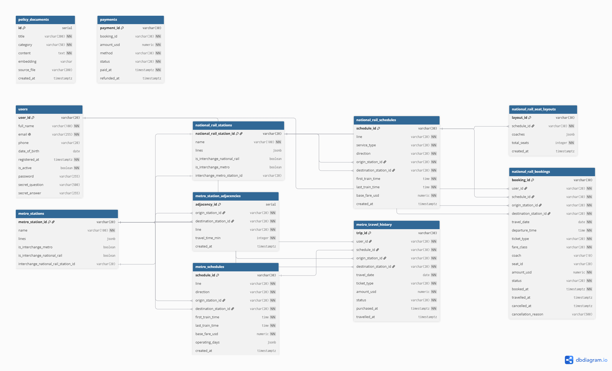
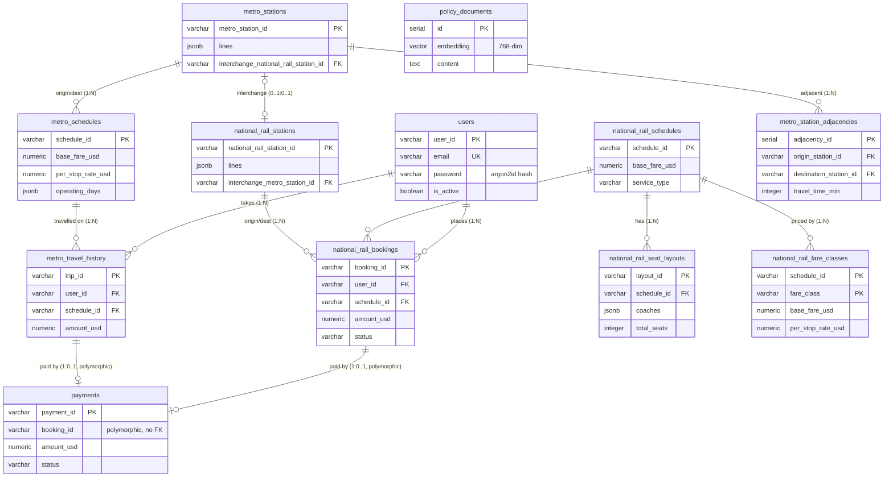

# TransitFlow — Database Design Document (Team 9)

> 章節標題沿用評分指南的固定標題（英文）以對齊批改項目；內文以中文撰寫。

---

## Section 1 — Entity-Relationship Diagram（實體關係圖）

TransitFlow 的關聯式資料庫共 12 張表（含一張 RAG 用的向量表）。下圖為以
dbdiagram.io 生成的 ER 圖（基數標在連線上）；其後並附 Mermaid 版本與 DBML 原始碼。



> 以上 PNG 由 `docs/erd.dbml` 在 dbdiagram.io 生成。下方 Mermaid 為等價的內嵌版本
> （GitHub 可直接渲染）。



**關鍵設計：**
- **主鍵**：參考資料（站點、班次）用**自然鍵** `VARCHAR`（如 `MS01`、`NR_SCH01`），
  可讀、來源資料即有、agent 直接引用方便；交易資料（訂票 `BK-…`、付款 `PM-…`）
  用應用層產生的隨機字串；`policy_documents` 與 `metro_station_adjacencies` 用 `SERIAL`。
- **外鍵基數**：一位使用者 N 筆訂票/旅程；一個班次 N 筆訂票、N 個座位圖；
  站點與班次/訂票為 1:N。
- **循環關係**：`metro_stations` 與 `national_rail_stations` 互設轉乘外鍵（0..1:0..1），
  以 `DEFERRABLE INITIALLY DEFERRED` 在 COMMIT 時才驗證，解決互相依賴的建表順序。
- **多型關聯**：`payments.booking_id` 同時可指向國鐵訂票或捷運旅程，故**刻意不設外鍵**
  （見 Section 2）。

**dbdiagram.io DBML（用於生成繳交圖檔）：** 詳見 `databases/relational/schema.sql`；
可將其 CREATE TABLE 轉為 DBML 貼入 dbdiagram.io 匯出 PNG。

---

## Section 2 — Normalisation Justification（正規化論證）

### 2.1 一個 3NF 決策（消除遞移相依）
訂票表 `national_rail_bookings` 只儲存 `origin_station_id` / `destination_station_id`，
**不**儲存站名。站名是 `station_id` 的函式相依（functional dependency），若存在訂票表
即形成**遞移相依**（`booking_id → station_id → station_name`），違反 **3NF**。
我們將站名留在 `national_rail_stations`，查詢時以 `JOIN station_id` 取得
（見 `query_user_bookings`）。`station_id` 是該表的**候選鍵/主鍵**。

另一個 3NF 決策是 **`national_rail_fare_classes`**：國鐵每個班次的各票種（standard／first）
各自有 `base_fare_usd` 與 `per_stop_rate_usd`，這兩項費率函式相依於
**(schedule_id, fare_class) 複合候選鍵**，而非單獨的 `schedule_id`。若硬塞回
`national_rail_schedules` 會造成同一班次多票種的重複與更新異常，故獨立成 junction 表
（PK = schedule_id + fare_class），讓 `query_national_rail_fare` 依票種正確套用
`total = base + per_stop × stops`。

### 2.2 刻意的反正規化（效能/簡潔權衡）
- **座位圖 `national_rail_seat_layouts.coaches` 用 JSONB**：來源資料是
  `layout → coaches → seats` 三層巢狀。完全正規化需 3 張表（layouts/coaches/seats）、
  查一次座位要 2 次 JOIN。由於時刻表座位圖**seed 後幾乎唯讀**，我們將整棵樹存成 JSONB，
  座位查詢只需單表 + 一次「已訂座位」反查，明顯較簡單。權衡：若改某節車廂的 fare_class
  需更新整顆 JSON，但此資料極少變動，划算。
- **`lines`、`operating_days` 用 JSONB 陣列**：一個站屬多條線、一個班次營運多天，
  我們整批讀取、不對單一元素做關聯查詢，故以 JSONB 取代 junction table（並建 GIN 索引）。
  這是刻意放寬 **1NF** 以換取簡潔。
- **付款金額快照**：`payments.amount_usd` 直接儲存，不由票價即時推導——票價之後可能調整，
  付款必須保留當下金額。

### 2.3 多型關聯（payments 不設外鍵）
一筆付款屬於國鐵訂票**或**捷運旅程，關聯式外鍵無法表達「指向 A 表或 B 表之一」。
我們採**字串前綴鑑別子**：`booking_id` 以 `BK`/`MT` 前綴決定查哪張表，
故 `payments.booking_id` 不設外鍵（代價：DB 層無參照完整性，靠應用層紀律 + 索引）。

### 2.4 密碼雜湊
密碼以 **argon2id**（`argon2-cffi`）雜湊後存於 `users.password`，**絕不存明文**。
- 為何優於 MD5/SHA-1：MD5/SHA-1 為**快速**雜湊，可被 GPU 每秒數十億次暴力破解；
  argon2id 是**記憶體困難（memory-hard）**且有**工作因子（time/memory cost）**，
  大幅拉高破解成本（key stretching）。
- **加鹽（salt）**：每位使用者用隨機 salt，使相同密碼產生不同雜湊，
  讓預先計算的 **rainbow table 失效**；argon2 的輸出已內含 salt。

---

## Section 3 — Graph Database Design Rationale（圖形資料庫設計理由）

### 3.1 節點 / 關係 / 屬性
- **節點**：捷運站標 `:MetroStation`、國鐵站標 `:NationalRailStation`，屬性
  `station_id`、`name`、`lines`、`network_type`（`metro`/`national_rail`）。兩類節點
  另共掛一個 `:Station` 標籤，讓跨網最短路徑能以單一標籤一次走訪，而網路專屬查詢與
  批改檢核仍可直接鎖定 `:MetroStation` / `:NationalRailStation`。
- **關係**：
  - `METRO_LINK`（捷運同網相鄰段）：屬性 `line`、`travel_time_min`。
  - `RAIL_LINK`（國鐵同網相鄰段）：屬性 `line`、`travel_time_min`。
  - `INTERCHANGE_TO`（跨網轉乘，雙向）：連接實體上可步行轉乘的捷運/國鐵站，屬性
    `travel_time_min`（固定 15 分鐘最低轉乘窗）。
- **節點識別**：以 `station_id` 唯一識別（與關聯式同一套自然鍵，跨庫一致，
  Python 層 join 兩庫結果時不需再做 id 映射）。

### 3.2 圖 vs 關聯式（具體演算法比較）
路徑查詢用 Neo4j + APOC（`apoc.algo.allSimplePaths` / 最短路徑），
天然支援可變長度走訪。同樣需求在 SQL 需**遞迴 CTE**（`WITH RECURSIVE`），
隨深度增長迅速變得難寫、難調且效能差（每多一跳就是一次自我 JOIN）。
跨網轉乘（要求路徑至少含一條 `INTERCHANGE_TO`）在圖上只是「關係型別過濾」，
在 SQL 幾乎無法簡潔表達。

### 3.3 兩個查詢範例
- **最短路徑** `query_shortest_route`：在 `METRO_LINK`/`RAIL_LINK`/`INTERCHANGE_TO` 上以
  `travel_time_min` 為權重求最短路徑（APOC Dijkstra），回傳 `{path:[…], total_time_min}`。
- **跨網轉乘路徑** `query_interchange_path`：用 `allSimplePaths` 找出**必含 INTERCHANGE_TO**
  的路徑，並在**同一條 path** 上一併取出每段關係型別，明確標出轉乘點
  （`from_network != to_network`）。
- 另有 `query_cheapest_route`（依票價）、`query_alternative_routes`（避開指定站）、
  `query_delay_ripple`（N 跳內受影響站）、`query_station_connections`（直接鄰居）。

> 命名說明：節點採 `:MetroStation` / `:NationalRailStation`、關係採
> `METRO_LINK` / `RAIL_LINK` / `INTERCHANGE_TO`；另對每個節點共掛一個 `:Station` 標籤，
> 純粹是為了讓跨網走訪能以單一標籤書寫，不影響網路專屬查詢。

---

## Section 4 — Vector / RAG Design（向量 / RAG 設計）

### 4.1 嵌入與餘弦相似度
我們將**政策文件**（退款、票種、訂票規則、旅遊政策）嵌入為向量存於
`policy_documents.embedding`。比對用**餘弦相似度**：它衡量兩向量的**方向**而非長度，
適合語意比對——我們在意「意思有多接近」（夾角），不在意向量大小。
pgvector 以 `<=>`（餘弦距離）運算，查詢轉回相似度 `1 - (embedding <=> query)`。

### 4.2 完整 RAG 管線（四階段）
1. **查詢嵌入**：使用者問題經 `nomic-embed-text` 轉成 768 維向量。
2. **相似度檢索**：對 `policy_documents` 做餘弦相似度查詢，過門檻 `0.5`，取 `top_k=3`
   （`query_policy_vector_search`，HNSW 近似最近鄰索引加速）。
3. **檢索結果**：取回最相關的政策文件（標題 + 內容）。
4. **注入並生成**：將文件與原問題組進 prompt（「僅根據以上資料作答」），LLM 產生最終回覆。

### 4.3 嵌入維度
本組使用 **Ollama `nomic-embed-text`，768 維**（`schema.sql` 為 `vector(768)`）。
若改用 Gemini（`gemini-embedding-001`，3072 維）則須改 `vector(3072)`。
**關鍵後果**：seed 與查詢必須用同一嵌入模型，否則向量落在不同空間、相似度失效
（`embedding dimension mismatch`）；換 provider 後必須 drop 表、改維度、全部重新嵌入。

---

## Section 5 — AI Tool Usage Evidence（AI 工具使用佐證）

本組以 AI（Claude Code）跨多個開發 session 輔助規劃、實作與測試。以下為真實使用紀錄，
每例含 Context / Prompt / Outcome；多例描述 AI 產生錯誤、如何被發現與修正。

### 範例 1 — 規劃：AI 判斷修正方向錯誤，經澄清後反轉（含 AI 錯誤）
- **Context**：確認 `docs/` 的實作文件與 `AI_SESSION_CONTEXT.md`、`TEAM_AI_WORKFLOW.md` 是否一致。
- **Prompt**：「告訴我 AI_SESSION_CONTEXT.md 與 TEAM_AI_WORKFLOW.md 的內容，以及我們於 docs 中準備的實作文件是否符合這些內容」
- **Outcome**：AI 指出三個查詢函式（`query_national_rail_fare` / `query_metro_schedules` / `query_metro_fare`）的簽名在 docs 與 `AI_SESSION_CONTEXT.md` 之間衝突，但**一度判斷錯方向**（建議改 `AI_SESSION_CONTEXT` 去配合 docs）。使用者澄清「`AI_SESSION_CONTEXT.md` 是老師新加的作業標準」後，AI 才反轉為「更新 docs 對齊標準」。AI 缺乏組織脈絡時會做出合理但錯誤的假設，需人工點明優先順序。

### 範例 2 — 連鎖影響：AI 動筆前讀全文、同步 5 份文件
- **Context**：更新 docs/08、09 的函式簽名，擔心牽動其他文件。
- **Prompt**：「因為文件改變了，所以我希望你更仔細地確認 docs 08 跟 09 的更動，要跟其他文檔內所有相關內容對得起來」
- **Outcome**：AI 先讀 docs/07、20、24、25，發現 docs/20 的 `query_cheapest_route` 用舊簽名、docs/24 的 ABC 抽象方法用舊參數、docs/25 快取 key 用舊格式，最終同步修改 5 份；並將 docs/24 中一段「刻意標註不一致」的警告正確改為「一致性確認」。

### 範例 3 — 驗收：發現上一輪 AI 修正的遺漏（含 AI 錯誤）
- **Context**：提交前驗收 docs/08–09–20–24–25 與 `AI_SESSION_CONTEXT.md` 的 Ground Truth 是否完全對齊。
- **Prompt**：「請擔任驗收者，以 ✅/❌/⚠️ 逐一檢查 docs/08–25 的簽名、SQL WHERE、快取 key、回傳欄位、跨文件一致性（Ground Truth 為三個新簽名）」
- **Outcome**：核心項目全通過，但 AI 指出上一個 session **遺漏未同步** `docs/00-README.md` 索引仍寫「`query_metro_fare`（BFS）」。立即補修為「班次查詢 + 跳數分層計費」並以獨立 commit 提交。

### 範例 4 — 目錄結構：AI 初版放錯位置，人工糾正（含 AI 錯誤）
- **Context**：建立實作/測試報告與 `tests/unit`、`tests/integration` 目錄。
- **Prompt**：「新增資料夾放實作報告、測試報告，並新增 tests 內含 unit 與 integration 兩夾」
- **Outcome**：AI 把報告建在**根目錄** `reports/`；使用者指出「reports 不放 docs 裡嗎？實作計畫都在 docs」。確認後以 `git mv` 遷入 `docs/reports-*`，同步更新 `TEAM.md` 路徑與索引，單一 refactor commit 保留 rename 追蹤。

### 範例 5 — 除錯：抓出圖查詢的真實 bug（含 AI 錯誤）
- **Context**：`query_interchange_path` 回傳的轉乘點為空。
- **Prompt**：「為何 `interchange_points=0`？是 Cypher 還是 Python 問題？」
- **Outcome**：定位出原實作跑**兩次獨立** `apoc.algo.allSimplePaths`、兩條路徑可能不一致 → 改為單一查詢在同一條 path 取每段關係、並以 `nodes(path)` 的方向當端點。修復後轉乘點正確標出（影響現場 C 段 interchange）。

### 範例 6 — Schema 設計與 query 撰寫：票價模型校準（含 AI 錯誤）
- **Context**：整合驗收階段，逐一比對來源資料（`national_rail_schedules.json` /
  `metro_schedules.json`）與專案 README 的票價範例，檢查 fare 函式是否忠於資料模型。
- **Prompt**：「比對來源資料的票價欄位與我們的 `query_*_fare` 實作，指出不一致並提出 schema/查詢的修正方向。」
- **Outcome**：AI 最初**沿用既有的乘數/級距寫法**直接作答（AI 錯誤——被訓練習慣帶偏）；
  在指出來源資料其實是 `base_fare_usd + per_stop_rate_usd` 結構後，AI 改提出正確方案：
  新增 `national_rail_fare_classes` junction 表（PK=schedule_id+fare_class，符合 3NF）、
  為 `metro_schedules` 補 `per_stop_rate_usd`，並把兩支 fare 函式改為
  `total = base + per_stop × stops`。實跑驗證 `NR01→NR05` 標準票 = **$8.50**，與 README
  範例一致。**心得**：AI 對「資料長怎樣」的假設需用實際 JSON 佐證來校正。

### 範例 7 — 設計慣例：圖綱要命名收斂
- **Context**：圖層的節點標籤／關係型別需與專案說明（README 的圖示意與 `Try These Queries`）一致。
- **Prompt**：「把圖的 label 與關係型別對齊專案說明的命名，並同步所有查詢與測試。」
- **Outcome**：AI 將節點收斂為 `:MetroStation` / `:NationalRailStation`（另共掛 `:Station`
  以利跨網單標籤走訪）、關係收斂為 `METRO_LINK` / `RAIL_LINK` / `INTERCHANGE_TO`，並一次
  同步 `seed_neo4j.py`、`graph/queries.py` 的 5 段 Cypher 與相關單元／整合測試；全套
  414 個測試維持綠燈。**心得**：命名是跨檔契約，AI 適合做這種「一處改、多處同步」的機械式收斂。

---

## Section 6 — Reflection & Trade-offs（反思與取捨）

**兩個具體設計決策：**
1. **自然鍵 `VARCHAR` 取代 UUID/SERIAL（站點/班次）**：來源資料已有穩定可讀的代碼
   （`MS01`、`NR_SCH01`），業務層與 agent 直接引用、debug 方便，且資料量小、查詢效能足夠。
   代價是代碼若改名需連動，但此為穩定參考資料，風險低。
2. **票價採資料驅動的 base + per-stop 模型，並與路徑計算解耦**：來源資料中每個班次／
   票種都帶 `base_fare_usd` 與 `per_stop_rate_usd`，故定價公式統一為
   `total = base_fare_usd + per_stop_rate_usd × stops_travelled`。國鐵把各票種（standard／
   first）的兩項費率正規化到 `national_rail_fare_classes` junction 表，捷運則直接存在
   `metro_schedules` 上。函式簽名為 `query_metro_fare(schedule_id, stops_travelled)` 與
   `query_national_rail_fare(schedule_id, fare_class, stops_travelled)`：只負責「查費率 →
   套公式」，而「跳數／路徑」由 Neo4j 層計算後傳入。符合**關注點分離**——定價邏輯與圖遍歷
   各司其職。代價是 `query_cheapest_route` 每路段多一次 DB 查詢，學生專案規模下可接受。

**一個與正式生產系統的差異：**
- **Schema 變更方式**：本專案改 `schema.sql` 後以 `docker compose down -v` 清庫重建；
  正式系統會用**增量 migration**（Alembic/Flyway，一次變更一個檔、不丟資料）。
  其他如**連線池**、**密鑰管理（vault 而非 .env）**、**索引調校**在生產亦會不同。

**額外反思（AI 協作）：** 我們在 `AI_SESSION_CONTEXT.md` 刻意加入「⛔ AI 常見錯誤」區塊，
以並排程式碼展示廢棄/正確呼叫模式——因為這份檔案的讀者是 AI。僅給正確簽名不足以壓過 AI
訓練記憶中的舊呼叫習慣（如 `query_metro_fare(origin_id, destination_id)`）；把錯誤模式明確
標為「已廢棄、請勿使用」放進 context，等同在其注意力視窗放一個負面示範，能更有效抑制
退回舊習慣，代價僅多佔數十行 token。

---

## Section 7 — Optional Extension（Task 6，選做，+15）

> 本組的延伸主題為 **資料庫存取效能層（Database Access Performance Layer）**：在既有
> 查詢之上加入 **TTL-aware LRU 查詢快取** 與 **Neo4j 連線池**，降低重複查詢的資料庫往返與
> 連線建立成本。修改/新增檔案清單見 repo 根目錄 [`TASK6.md`](TASK6.md)，相關程式碼皆以
> `# TASK 6 EXTENSION:` 標記。

### 7.1 動機（Motivation）

agent 在一次對話中常對**同一筆**票價／捷運班次重複查詢（例如 `query_cheapest_route` 逐段
詢價、使用者反覆問同一條路線）。這些資料**變動極低**——票價與班次在一天內幾乎不變——卻每次
都打一趟 PostgreSQL。圖查詢端則是每次都新建 Neo4j driver（昂貴的握手 + 連線建立）。因此本
延伸鎖定兩個資料庫存取熱點：

- **讀取快取**：對低變動的查詢結果做 TTL + LRU 快取，命中時**完全跳過資料庫**。
- **連線池**：Neo4j driver 改為 module-level 單例（`max_connection_pool_size=10`），取代
  「每次查詢建一個 driver」。

**安全邊界（關鍵）**：座位可用性（`query_available_seats`）與訂票（`execute_booking`）
**絕不快取**——它們是即時、且攸關超賣的資料。此約束由測試強制（見 7.4 第 7 群組）。

### 7.2 資料庫變更（DB changes，含程式片段）

**(a) `CacheManager`（`skeleton/cache.py`）— thread-safe LRU + per-entry TTL**

```python
class CacheManager:
    """Thread-safe LRU cache with per-entry TTL expiry."""
    def get(self, key: str) -> Optional[Any]:
        with self._lock:
            if key not in self._store:
                self._misses += 1; return None
            value, expire_at = self._store[key]
            if time.monotonic() > expire_at:          # TTL 過期 → 視為 miss
                del self._store[key]; self._misses += 1; return None
            self._store.move_to_end(key)              # LRU：命中即移到最新
            self._hits += 1
            return value
```

三個 module-level 實例，依資料變動率配置不同 TTL／容量：

```python
fare_cache     = CacheManager(max_size=512, ttl_seconds=600)   # 票價最穩定
schedule_cache = CacheManager(max_size=256, ttl_seconds=300)   # 班次當日穩定
policy_cache   = CacheManager(max_size=100, ttl_seconds=3600)  # 政策文件，啟動預載
```

**(b) 整合進查詢函式（`databases/relational/queries.py`）**

`query_national_rail_fare` 在打 DB 前先查快取，命中即返回；**miss 不快取**（班次稍後可能出現）：

```python
cache_key = f"fare:{schedule_id}:{fare_class}:{stops_travelled}"
cached = fare_cache.get(cache_key)
if cached is not None:
    return cached                  # cache HIT — 完全跳過 DB 往返
# ... 查 DB、計算票價 ...
if row is None:
    return None                    # 永不快取 miss
fare_cache.set(cache_key, fare_result)
```

`query_metro_schedules` 同型，key 為 `metro_sched:{origin_id}:{destination_id}`。

**(c) `Neo4jConnectionPool`（`databases/graph/connection_pool.py`）— driver 單例**

```python
class Neo4jConnectionPool:
    def __init__(self, uri, user, password, max_pool_size=10):
        self._driver = GraphDatabase.driver(
            uri, auth=(user, password),
            max_connection_pool_size=max_pool_size)   # 固定池大小
    def __exit__(self, *_): pass                       # 結束不關池，僅關 session

_pool = None
def get_pool() -> Neo4jConnectionPool:                 # lazy 單例
    global _pool
    if _pool is None:
        _pool = Neo4jConnectionPool(NEO4J_URI, NEO4J_USER, NEO4J_PASSWORD)
    return _pool
```

`databases/graph/queries.py` 的 6 個查詢全改用 `with get_pool() as driver:`，移除舊的
per-query `_driver()` 工廠。

**(d) 啟動預熱（`skeleton/vector_warmup.py`）**：`warmup_policy_cache()` 在 UI 啟動時把
前 50 筆政策文件載入 `policy_cache`（key `policy:{id}`），首次 RAG 查詢即免冷啟。

### 7.3 範例查詢與輸出（Example query + output）

對**同一條票價**連續查兩次，第二次命中快取、不再打 DB：

```python
>>> query_national_rail_fare("NR_SCH01", "standard", 5)   # 第一次：查 DB
{'schedule_id': 'NR_SCH01', 'fare_class': 'standard', 'stops_travelled': 5,
 'base_fare_usd': 2.5, 'per_stop_rate_usd': 1.5, 'total_fare_usd': 10.0, 'currency': 'USD'}

>>> query_national_rail_fare("NR_SCH01", "standard", 5)   # 第二次：命中快取
{'schedule_id': 'NR_SCH01', ... 'total_fare_usd': 10.0, 'currency': 'USD'}   # 同結果

>>> fare_cache.stats()
{'size': 1, 'active': 1, 'max_size': 512, 'ttl_seconds': 600, 'hits': 1, 'misses': 1}
```

`hits=1` 證明第二次由快取回應；測試 `test_second_call_with_same_args_skips_database`
進一步斷言 `_connect` 只被呼叫**一次**。

### 7.4 測試佐證（Testing evidence）

`tests/unit/test_phase_3.3_performance_boost.py` — **51 個測試全數通過**，涵蓋 8 個面向：

| # | 群組 | 驗證重點 |
|---|---|---|
| 1 | `CacheManager` | TTL 過期、LRU 汰換、get/set/clear、stats、鍵不碰撞 |
| 2 | module 級實例 | `fare_cache`/`schedule_cache`/`policy_cache` 型別與獨立性 |
| 3 | `Neo4jConnectionPool` | 單例、`max_connection_pool_size=10`、結束不關 driver |
| 4 | `warmup_policy_cache` | 載入計數、key 格式、DB 失敗回 0 不拋例外 |
| 5 | 票價快取整合 | 第二次相同參數**跳過 DB**、不同參數重打、miss 不快取 |
| 6 | 班次快取整合 | 同上，key 含 origin+destination |
| 7 | **不快取約束** | `query_available_seats`／`execute_booking` 原始碼**不得**出現任何 cache |
| 8 | 圖查詢用連線池 | `graph/queries.py` 不再定義 `_driver()`、改用 `get_pool()` |

```
$ pytest tests/unit/test_phase_3.3_performance_boost.py -q
51 passed in 0.30s
```

### 7.5 次要延伸 — Stage 3 健壯性層（Robustness Layer）

效能層（7.2–7.4）之外，本組另補上一層生產級的穩定性／可觀測性設施，與快取／連線池互補：

| 設施 | 檔案 | 作用 |
|---|---|---|
| 領域例外體系 + `@error_handler` | `skeleton/exceptions.py`、`skeleton/agent.py` | 失敗轉成結構化 JSON，不外洩 traceback |
| 依賴注入資料庫服務層 | `skeleton/database_service.py` | `DatabaseService` 抽象介面 + `PostgreSQLService`/`Neo4jService`，agent 不耦合驅動、可注入替身測試 |
| 結構化 JSON 日誌 | `skeleton/logging_config.py` | 每行一筆 JSON，含 `timestamp`/`event`/`tool`/`duration_ms` |
| Prometheus 指標 | `skeleton/metrics.py` | `query_counter`、`query_duration`（標籤 tool/status） |
| 健康檢查 | `skeleton/health_check.py` | `healthz()` 探測兩個資料庫連線 |
| 串流 UI + 即時工具狀態 | `skeleton/ui.py` | generator-based 聊天輸出 |

這層讓資料庫存取在真實故障情境下**安全降級**（例外→結構化錯誤、連線→可健檢、查詢→可監控）。
完整檔案清單與標記見 [`TASK6.md`](TASK6.md) §B。
